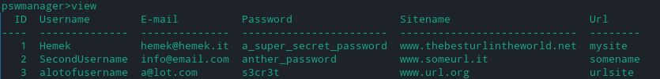

# Password Manager

A simple command-line tool to store securely all your password!

## Table of Contents
* [Why passwordManager?](#why-passwordmanager?)
* [Technologies and Libraries](#technologies-and-libraries)
* [Setup](#setup)
* [How to launch the tool](#how-to-launch-the-tool)
* [How it works](#how-it-works)
* [Commands](#commands)
* [Screenshot](#screenshot)
* [Author](#author)

<!-- * [License](#license) -->

## Why passwordManager?

In the times we live in, it becomes more and more daily to register on new sites or platforms, so we need to always enter new passwords, and let's face it, who is using a different password every time, knowing the risks we face ?
Hence the need to have an efficient and secure password manager, who is able to store all the passwords and be able to retrieve them when needed.

The password manager proposed here will guarantee security and persistence to all your passwords, it will maintain an encrypted database, and only by entering the exact password (chosen at the first start) will you be able to access the data.

A reason why not to use password manager? I don't know him, the choice is yours.

Any suggestion / modification is welcome, in case of bugs please report them!

I have no liability whatsoever for the use of this software 

## Technologies and Libraries
```
Python 3.9.3 (programming language)
sqlite3 (db)
hashlib (library) --> Installed by default
os (library) --> Installed by default
base64 (library) --> Installed by default
tabulate (library) --> Installed by default
pyAesCrypt (library) --> NOT Installed by default, to install type: pip install pyAesCrypt
sqlite3 (library) --> NOT Installed by default, to install type: pip install sqlite3
```
## Setup
```
$ git clone https://github.com/giovannimirarchi420/passwordManager
$ pip install pyAesCrypt
$ pip install sqlite3
```

## How to launch the tool
To launch the tool type:
```
python pswManager.py
```
Or replace pswManager.py with the file path if you aren't in the same directory

## How it works

When start the tool with ```python pswManager.py``` it ask you to set a new password for the tool, after this at every launch of the tool, you must insert the same password to access to database and command tool.
When a password is setted, pswManager create a ```config.psw``` file, where is stored the encrypted password (sha256) combined with the salt, the salt is a random value generated at password choosing moment.
After password choosing, on restart of the tool, pswManager extract the salt from config.psw file, encrypt with the same salt the provided password from user and go to check if the encrypted password stored in config.psw and the generated token is the same, if true the access is grant.
The same token (password + salt), is the secret key for db encrypting/decrypting, using aes through pyAesCrypt module, so when ```exit``` command was launched from user, pswManager tool provide to encrypy and to decrypt at login phase.

## Commands

There are only 4 simple command: (you can get them typing "help" after tool start)

- createpsw --> It permit you to add a password into database, after call the command, the tool ask you all the needed info.
- view --> View all password saved into db.
- remove --> It permit you to remove a password from database, after call the command, the tool ask you all the needed info.
- exit --> Exit from tool, it's really important to use this command, to ensure the db encryption and guarantee the correct behaviour to ne next session.
- change-tool-psw -->   Change the passowrd for pswManager tool.
- chgpsw -->   Change the password for the selected entry, after call the command, the tool ask you all the needed info.

## Screenshot


## Author

This project was made by Giovanni Mirarchi (alias @Hemek), BSc in Computer Engineering.
- Linkedin: https://www.linkedin.com/in/giovanni-mirarchi/
- E-mail: giovanni.mirarchi<at>hotmail.com
  
  Feel free to contact me!.
